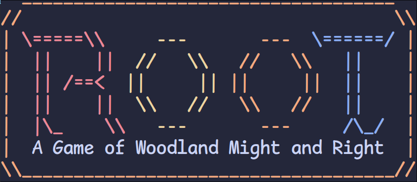
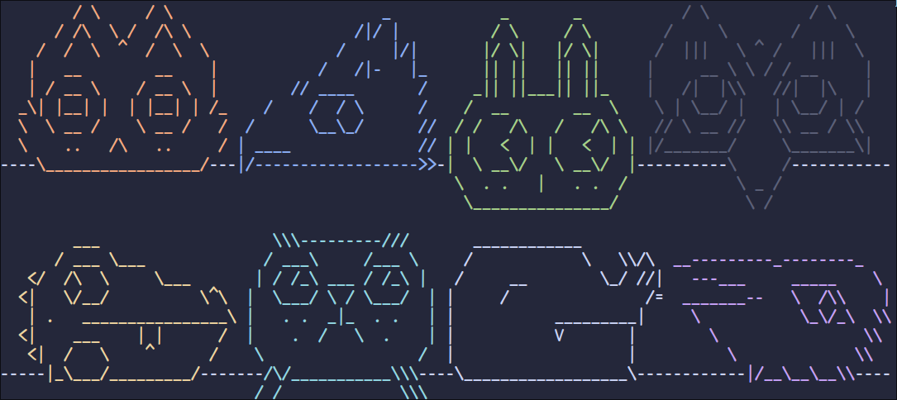

# The Rootbotics Assistant - Take the thinking out of managing automated factions!

## About
The Rootbotics Assistant is based on the following expansions for the board game
[Root](https://ledergames.com/products/root-a-game-of-woodland-might-and-right):
- [The Clockwork Expansion](https://ledergames.com/products/root-the-clockwork-expansion)
- [The Clockwork Expansion 2](https://ledergames.com/products/root-the-clockwork-expansion-2?variant=42703095038173)

The Rootbotics Assistant exists to alleviate the stress and complexity that might be
had while managing the automated factions by handling the turn progression and
some of the decision analysis for the user. **Note:** this tool is used entirely in
the terminal and lacks a GUI implementation!

The Rootbotics Assistant is currently in an unfinished state. 
| Feature | State | Details |
| :------ | :---: | :------ |
| Mechanical Marquise 2.0 | x | |
| Electric Eyrie | x | |
| Automated Alliance | ~ | Traits and Difficult left |
| Vagabot | x | |
| Logical Lizards | ~ | Traits and Difficulty left |
| Riverfolk Robots | x | Will be very complex... |
| Drillbit Duchy | ~ | Traits and Difficulty left |
| Cogwheel Corvids | x | |
| Special Map Functions | x | Pertaining to Mountain and Lake |



## Installation
### Requirements
- Alire ([Ada LIbrary REpository](https://alire.ada.dev/))

In the project root directory:
```
$ alr build
```
## Understanding the Interface
Because the interface is restricted to the terminal, some elements
are non-trivial to understand. The following describes what certain
design constructs represent.

### Map - Clearings
```
                Rule? --       -- Token? (Yes = 'T', No = '@')
                         \   /
Number of Buildings --- 2-^-@    - Number of Warriors
                        | 5 | -/
               Suit --- F---1 --- Priority
```

## Credits
Thanks to Leder Games for the creation and publication of Root and its
expansions as well as the permission to develop this tool.
